

# 📖 تطبيق القرآن المتخصص: الخطة الشاملة المصوّرة

> **ملاحظة للعرض:** الرسومات في هذا الملف مكتوبة بصيغة Mermaid. افتحه في محرر يعرضها (VS Code مع إضافة Markdown Mermaid، أو Obsidian، أو Typora، أو GitHub) لتظهر الرسومات بدل الكود.

---

## 📑 محتويات الملف

1. الرؤية والمبادئ
2. الخريطة الكبرى للتطبيق
3. التنقل وهيكل الشاشات
4. الأقسام بالتفصيل (القراءة، الاستماع، الختمة، البحث، العلامات، الحفظ، المراجعة، الاختبارات، المتشابهات، التفسير، الإعراب، أسباب النزول، البيان الإعجازي)
5. الإضافات المقترحة
6. المعمارية التقنية
7. نموذج البيانات
8. التنزيلات الاختيارية
9. النسخة الاحتياطية
10. خارطة الطريق والمراحل
11. المحتوى والمصادر والمراجعة الشرعية
12. الخصوصية والأداء وإمكانية الوصول
13. الجودة والاختبار
14. المخاطر والحلول
15. القرارات المفتوحة وقائمة المهام

---

## 1️⃣ الرؤية والمبادئ

**الفكرة:** تطبيق متخصص في القرآن الكريم فقط، متوسّع ومتعمّق بشكل غير عادي: قراءة واستماع وحفظ ومراجعة واختبار وفهم وإعراب ومتشابهات، في مكان واحد.

| المبدأ | ما يعنيه عمليًا |
|---|---|
| التخصص | القرآن فقط، بلا أقسام خارج الموضوع |
| العمق | كل قسم مبني ليكون مرجعًا وليس مجرد ميزة |
| العمل بدون إنترنت | كل شيء يعمل محليًا، والإنترنت للتنزيل الاختياري فقط |
| بدون حسابات | لا تسجيل ولا مزامنة ولا سيرفر لبيانات المستخدم |
| الخصوصية الكاملة | لا بيانات تُرسل لأي جهة |
| الدقة أولًا | كل نص وتفسير وإعراب من مصدر موثوق ومراجَع |
| المنصات | أندرويد وآيفون بكود واحد |

---

## 2️⃣ الخريطة الكبرى للتطبيق

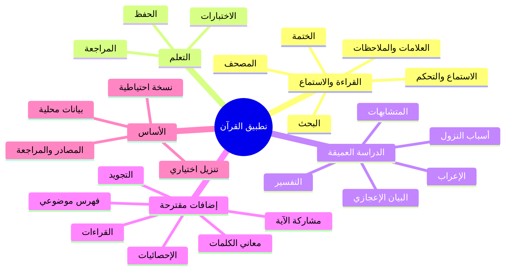

---

## 3️⃣ التنقل وهيكل الشاشات

### شريط التنقل السفلي (5 تبويبات)

```mermaid
flowchart TB
    APP["التطبيق"] --> T1["🏠 الرئيسية"]
    APP --> T2["📖 المصحف"]
    APP --> T3["🧠 الحفظ"]
    APP --> T4["🔍 الدراسة"]
    APP --> T5["⚙️ المزيد"]

    T1 --> H1["أكمل من حيث توقفت"]
    T1 --> H2["ورد اليوم"]
    T1 --> H3["مراجعة اليوم"]
    T1 --> H4["ملخص التقدم"]

    T2 --> R1["القراءة"]
    T2 --> R2["الاستماع"]
    T2 --> R3["البحث"]
    T2 --> R4["العلامات والملاحظات"]

    T3 --> M1["خطط الحفظ"]
    T3 --> M2["المراجعة"]
    T3 --> M3["الاختبارات"]

    T4 --> S1["المتشابهات"]
    T4 --> S2["التفسير"]
    T4 --> S3["الإعراب"]
    T4 --> S4["أسباب النزول"]
    T4 --> S5["البيان الإعجازي"]

    T5 --> O1["الختمة"]
    T5 --> O2["التنزيلات"]
    T5 --> O3["الإعدادات"]
    T5 --> O4["نسخة احتياطية"]
    T5 --> O5["المصادر والمراجعة"]
```

### وصف الشاشة الرئيسية

| المنطقة | المحتوى |
|---|---|
| أعلى الشاشة | زر كبير: **أكمل من حيث توقفت** (يتذكر آخر موضع في القراءة/الحفظ/الاستماع) |
| الوسط | **ورد اليوم** و**مراجعة اليوم** كبطاقتين، مع نسبة الإنجاز |
| أسفلها | ملخص مصغر: أيام متواصلة، عدد الآيات المحفوظة، تقدم الختمة الحالية |

### رحلة المستخدم النموذجية

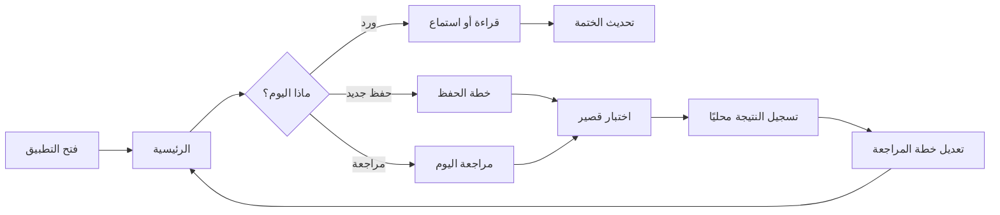

---

## 4️⃣ الأقسام بالتفصيل

### 📖 4.1 المصحف والقراءة

**الهدف:** قراءة مريحة ودقيقة بأي شكل يفضله المستخدم.

**المزايا**
- عرض بنمط **الصفحات** (كالمصحف الورقي) أو نمط **الآيات** المتتابعة.
- خط عثماني واضح، مع التحكم في **حجم الخط** والمسافات.
- أوضاع: نهاري، ليلي، وسِبيا (لون مريح للعين).
- تنقل سريع: سورة، جزء، حزب، ربع، صفحة، رقم آية.
- علامات السجدة والوقف تظهر بوضوح.
- ضغطة على الآية تفتح قائمة: استماع، تفسير، إعراب، متشابهات، علامة، ملاحظة.
- دعم نسخ مصحف متعددة بتنزيل اختياري (وترقيم الصفحات يختلف بينها).

**الشاشات:** قارئ المصحف، دليل السور والأجزاء، إعدادات القراءة.

---

### 🎧 4.2 الاستماع والتحكم

**الهدف:** استماع مضبوط على قدر ما يريد المستخدم.

**المزايا**
- **اختيار النطاق:** من سورة/آية إلى سورة/آية.
- **التكرار:** عدد مرات تكرار الآية، وعدد مرات تكرار النطاق كله.
- **اختيار القارئ** من الذين نزّلهم المستخدم.
- سرعة التشغيل، وتتبع الآية المقروءة مع تمييزها في المصحف.
- التشغيل في الخلفية وعلى شاشة القفل.
- مؤقت نوم.
- (مقترح) **تكرار بفاصل صمت:** يسكت التطبيق بعد كل آية بمقدار يحدده المستخدم ليردّد بعد القارئ.

---

### 🔁 4.3 الختمة

**الهدف:** ختمات منظمة بمدد يختارها المستخدم.

**المزايا**
- اختيار مدة الختمة (مثلًا 30 يومًا أو 60 أو مدة مخصصة).
- توزيع تلقائي: عدد الصفحات أو الأجزاء اليومي.
- متابعة التقدم، وإعادة توزيع الباقي لو فاتت أيام.
- عدّاد ختمات مكتملة، وإمكانية ختمات متزامنة (قراءة وحفظ).
- تذكيرات محلية بالورد.

---

### 🔎 4.4 البحث

**الهدف:** الوصول لأي آية أو كلمة في ثوانٍ.

**المزايا**
- بحث بكلمة أو جزء من آية، مع تجاهل التشكيل اختياريًا.
- بحث برقم سورة وآية مباشرة، أو باسم السورة.
- (لاحقًا) بحث بالجذر اللغوي.
- نتائج تُظهر السورة والآية وموضع الكلمة، ثم تفتح الآية في المصحف.

---

### 🔖 4.5 العلامات والملاحظات

**أنواع العناصر**

| العنصر | الوصف |
|---|---|
| علامة الاستمرار | تلقائية، لكل وضع (قراءة/حفظ/استماع) |
| علامة مرجعية | آية أو نطاق، باسم ولون ومجلد |
| ملاحظة | نص حر على آية أو نطاق أو كلمة |
| تظليل | تلوين آية أو كلمة |
| وسم | تصنيف مثل: تدبر، صعبة في الحفظ، متشابه |

**قواعد مهمة**
- تُربط كل علامة **برقم السورة + رقم الآية** (وترتيب الكلمة عند الحاجة)، وليس برقم الصفحة، حتى تبقى صحيحة مع تغيير نسخة المصحف.
- وسم **"صعبة عليّ"** يدخل الآية تلقائيًا في خطة المراجعة بتكرار أعلى.
- شاشة **"محفوظاتي"** تجمع كل العناصر مع بحث وتصفية.
- حذف مع خيار **تراجع** بدل رسائل التأكيد.
- كل العناصر تدخل في النسخة الاحتياطية.

---

### 🧠 4.6 الحفظ

**الهدف:** خطط حفظ متعمقة تناسب وقت المستخدم وقدرته.

**المزايا**
- **إنشاء خطة:** اختيار النطاق (سورة/جزء/القرآن كله)، وعدد الأسطر أو الآيات يوميًا، وأيام الراحة.
- **مراحل الحفظ اليومي:** تلقين (استماع)، ثم ترديد، ثم تسميع بإخفاء الآيات، ثم ربط بما قبلها.
- **وضع إخفاء الآيات:** إخفاء الآية أو الكلمات الأخيرة أو كلمات عشوائية للتسميع الذاتي.
- علامات الحالة لكل مقطع: جديد، قيد الحفظ، محفوظ، ضعيف.
- تعدد الخطط في وقت واحد (حفظ جديد + تثبيت).
- إعادة حساب الخطة تلقائيًا عند التأخر.

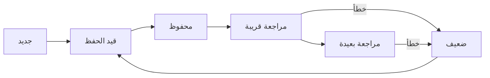

---

### 🔄 4.7 المراجعة

**الهدف:** تثبيت المحفوظ بحيث لا يضيع.

| النوع | المقصود | الافتراض المقترح |
|---|---|---|
| مراجعة **قريبة** | ما حُفظ حديثًا | تكرار متقارب في الأيام الأولى |
| مراجعة **بعيدة** | المحفوظ القديم | تكرار متباعد، بتوزيع يومي ثابت |
| مراجعة **شاملة** | دورة كاملة على كل المحفوظ | جدول دوري (أسبوعي/شهري) |

**آلية الجدولة**
- خوارزمية **التكرار المتباعد** (مثل SM-2 أو FSRS) تُنفّذ محليًا على الجهاز.
- المقاطع الضعيفة أو المعلّمة "صعبة عليّ" يزيد تكرارها.
- **حصة يومية** قابلة للضبط حتى لا تتراكم المراجعة.
- شاشة **"مراجعة اليوم"** تعرض ما يجب مراجعته بترتيب الأولوية.
- تقرير بأضعف السور والأجزاء.

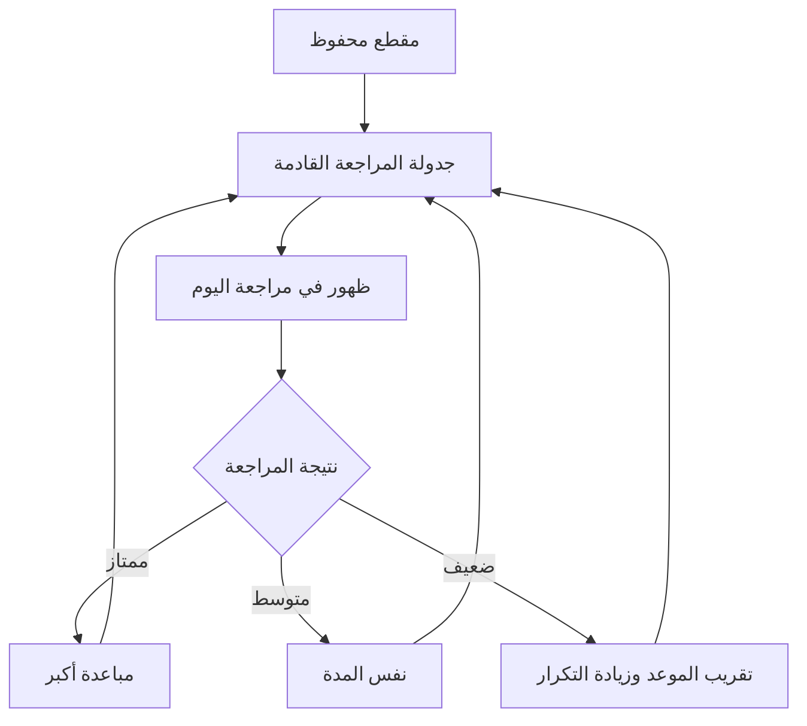

---

### 📝 4.8 الاختبارات

**الهدف:** قياس المستوى وتحديد مواطن الضعف.

**1) النطاق (يختاره المستخدم):** سورة، جزء، حزب، ربع، صفحات من/إلى، نطاق مخصص، "محفوظاتي"، أو "مواضع ضعفي".

**2) المستويات**

| المستوى | نوع الأسئلة | المساعدة | الوقت |
|---|---|---|---|
| ضعيف | اختيار من متعدد، أكمل الكلمة | تلميحات كثيرة | مفتوح |
| متوسط | أكمل الآية، الآية التالية | تلميح واحد | واسع |
| جيد | الآية السابقة/اللاحقة، ترتيب آيات | تلميح محدود | متوسط |
| جيد جدًا | من أي سورة؟ رقم الآية؟ | بدون تلميح | ضيق |
| ممتاز | تمييز المتشابهات، إكمال من منتصف الآية | بدون تلميح | ضيق جدًا |
| متقن | متشابهات دقيقة، بدايات الصفحات، شرط الدقة الكاملة | بدون تلميح، خطأ واحد يوقف الاختبار | صارم |

**3) أنواع الأسئلة:** أكمل الآية، الآية التالية/السابقة، من أي سورة، رقم الآية، اختبار المتشابهات، تحديد الآية من صوت القارئ، ترتيب آيات مبعثرة، (لاحقًا) أسئلة على المعنى والإعراب.

**4) طريقة الإجابة:** اختيار أو كتابة في البداية. (التسميع الصوتي بتعرّف على الصوت مؤجل لمرحلة متأخرة لأنه أصعب تقنيًا.)

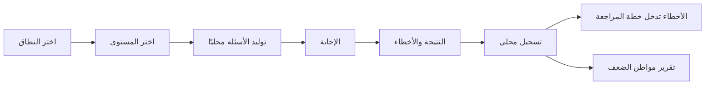

---

### 🔀 4.9 المتشابهات (القسم المميِّز)

**الهدف:** أقوى قسم متشابهات في تطبيق قرآني، للمتأمل والحافظ معًا.

**المزايا**
- **بحث بكلمة أو عبارة** يعرض كل المواضع المتشابهة، مجمّعة في مجموعات.
- **مقارنة آيتين جنبًا إلى جنب** مع **تظليل الفروق** كلمةً كلمة.
- **متشابهات فواتح السور** (كالبدايات المتماثلة والحروف المقطعة) و**خواتيمها**.
- **الآيات المتشابهة** داخل السورة الواحدة وبين السور.
- لكل مجموعة: ما يميّز كل موضع (اختلاف حرف/كلمة/ترتيب)، ليسهل الضبط.
- (مقترح) **تنبيه أثناء القراءة:** أيقونة على الآية التي لها متشابه.
- (مقترح) **اختبار المتشابهات** يتغذى من نفس البيانات.

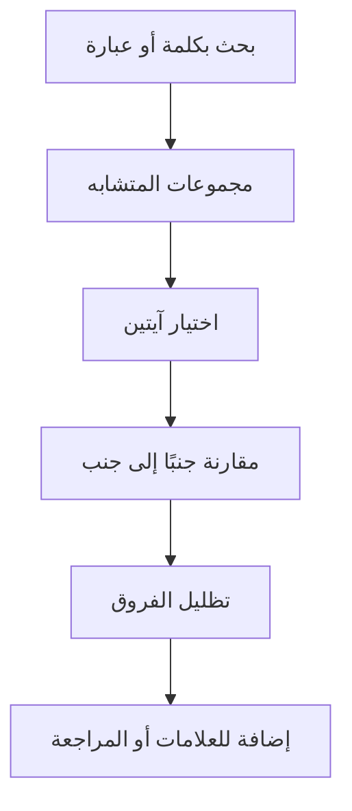

**أنواع مجموعات المتشابه**

| النوع | مثال على المقصود |
|---|---|
| متشابه لفظي | آيتان متطابقتان إلا في كلمة أو حرف |
| فواتح | سور تبدأ بصيغة متقاربة |
| خواتيم وفواصل | آيات تنتهي بخواتيم متقاربة |
| متشابه موضعي | تكرار قصة أو عبارة في سور مختلفة |

**بناء البيانات:** يُحسب الفهرس **مسبقًا** في مرحلة إعداد البيانات (تطابق كلمات ثم مقارنة على مستوى الكلمة)، ثم **يراجعه متخصصون**، ويُشحن جاهزًا داخل التطبيق. لا يُحسب على جهاز المستخدم.

---

### 📚 4.10 التفسير

- تفسير للقرآن **كاملًا**، بأكثر من تفسير للمقارنة (مثل: الميسر، السعدي، ابن كثير، الطبري).
- عرض تفسير الآية مباشرة من المصحف، أو استعراض كتاب التفسير بالتسلسل.
- الأصغر حجمًا يُشحن داخل التطبيق، والأكبر يكون **تنزيلًا اختياريًا**.
- بحث داخل نص التفسير.
- فصل بصري واضح بين كلام المفسّر وملاحظات المستخدم.

---

### 🧩 4.11 الإعراب الكامل

- **إعراب كل كلمة في القرآن**، مع التصريف (جذر، وزن، نوع الكلمة) عند توفر البيانات.
- عرض: اضغط على الكلمة في الآية لتظهر بطاقة الإعراب.
- وضع "إعراب الآية كاملة" في قائمة.
- بحث بالنوع (أفعال، أسماء موصولة، إلخ) مستقبلًا.
- **أكبر قسم من حيث تجهيز البيانات والمراجعة**، ويحتاج تخطيطًا مبكرًا للتراخيص.

---

### 🕰️ 4.12 أسباب النزول

- ربط كل سبب نزول بالآية أو الآيات التي يخصها.
- عرض السبب مع مصدره ودرجة الثبوت إن توفرت.
- يظهر في قائمة الآية، ولا يظهر إلا للآيات التي لها سبب.

---

### 💡 4.13 البيان الإعجازي

- لطائف التعبير القرآني: اختيار الألفاظ، التقديم والتأخير، الحذف والذكر، وغيرها.
- مربوط بالآيات، مع ذكر المصدر لكل فائدة.
- يُعامل كمحتوى مراجَع ومنسوب لمصدره، وليس اجتهادًا داخل التطبيق.

---

## 5️⃣ الإضافات المقترحة

| الإضافة | الفائدة | المرحلة المقترحة |
|---|---|---|
| إخفاء الآيات (تسميع ذاتي) | أساس الحفظ الفعلي | 2 |
| تكرار بفاصل صمت | ترديد بعد القارئ | 1 |
| تحديد المستوى (اختبار البداية) | يضبط الخطة الأولى | 2 |
| إحصائيات وإنجازات | متابعة وتحفيز | 2 |
| نسخة احتياطية (تصدير/استيراد) | حماية التقدم بدون حسابات | 2 |
| تذكيرات الورد والمراجعة | استمرار يومي (إشعارات محلية) | 1 |
| تنبيه المتشابه أثناء القراءة | تكامل القراءة والمتشابهات | 3 |
| اختبار المتشابهات | تثبيت الفروق | 3 |
| معاني الكلمات (غريب القرآن) | فهم أسرع | 4 |
| التجويد (ألوان وشرح) | ضبط التلاوة | 4 |
| فهرس موضوعي | تصفح الآيات بالموضوع | 4 |
| القراءات (حفص، ورش، ...) | توسع علمي | بعد الإصدار الأول |
| مشاركة الآية كصورة أو نص | نشر الخير | 4 |
| إدارة المساحة والتنزيلات | التحكم في حجم التطبيق | 1 |
| صفحة المصادر والمراجعة | الثقة والشفافية | 1 |

---

## 6️⃣ المعمارية التقنية

### الاختيار المقترح

| الطبقة | الاختيار | السبب |
|---|---|---|
| الإطار | **Flutter** | كود واحد للمنصتين، وتحكم ممتاز في عرض النص العربي والتلوين |
| قاعدة البيانات | **SQLite** (محلية) | بحث سريع، تعمل بلا إنترنت |
| الصوت | مشغّل يدعم الخلفية والتكرار المخصص | ضروري لقسم الاستماع |
| الإشعارات | إشعارات محلية | تعمل بلا سيرفر |
| الاستضافة | ملفات ثابتة فقط | لتنزيل الصوتيات والمصاحف |

### مخطط المعمارية

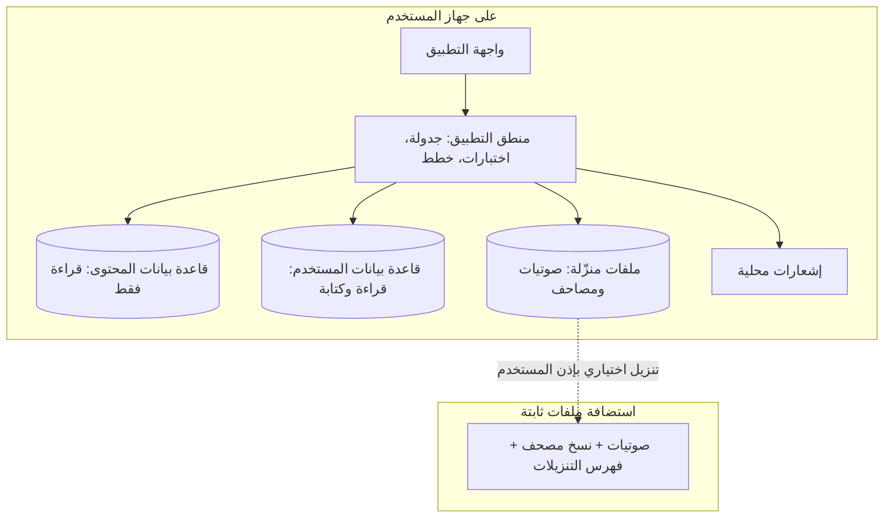

### فصل قاعدتي البيانات (قرار مهم)

| القاعدة | المحتوى | الكتابة |
|---|---|---|
| قاعدة **المحتوى** | المصحف، التفسير، الإعراب، المتشابهات، أسباب النزول | تُشحن جاهزة، **قراءة فقط** |
| قاعدة **المستخدم** | العلامات، الخطط، المراجعة، الاختبارات، الإعدادات | يقرأ ويكتب التطبيق |

**الفائدة:** تحديث المحتوى في إصدار جديد لا يمس بيانات المستخدم، والنسخة الاحتياطية تشمل قاعدة المستخدم فقط.

---

## 7️⃣ نموذج البيانات

### قاعدة المحتوى

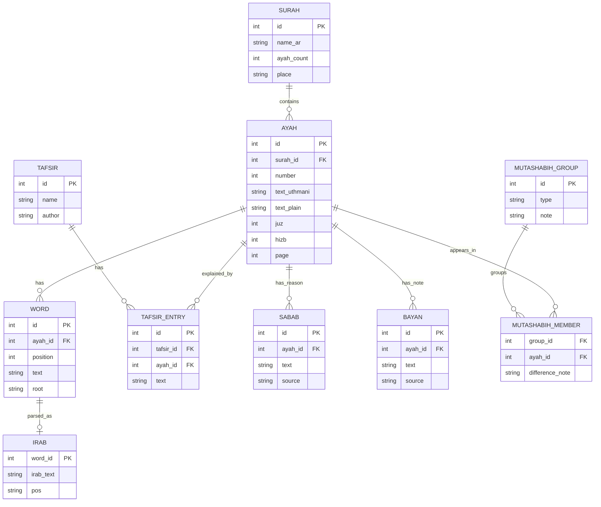

### قاعدة المستخدم

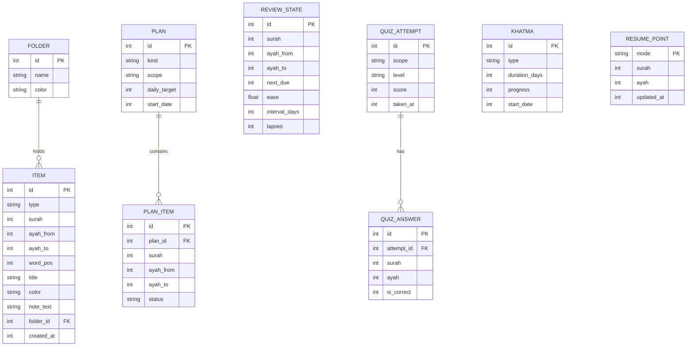

> **ملحوظة:** كل الارتباطات بالآيات في قاعدة المستخدم تكون بـ**رقم السورة + رقم الآية**، وليس بمعرّف داخلي، حتى تبقى صالحة عند تحديث قاعدة المحتوى.

---

## 8️⃣ التنزيلات الاختيارية

**الاستثناء الوحيد لاستخدام الإنترنت.** تتم بإذن المستخدم، وبعدها يعمل التطبيق بالكامل بدونه.

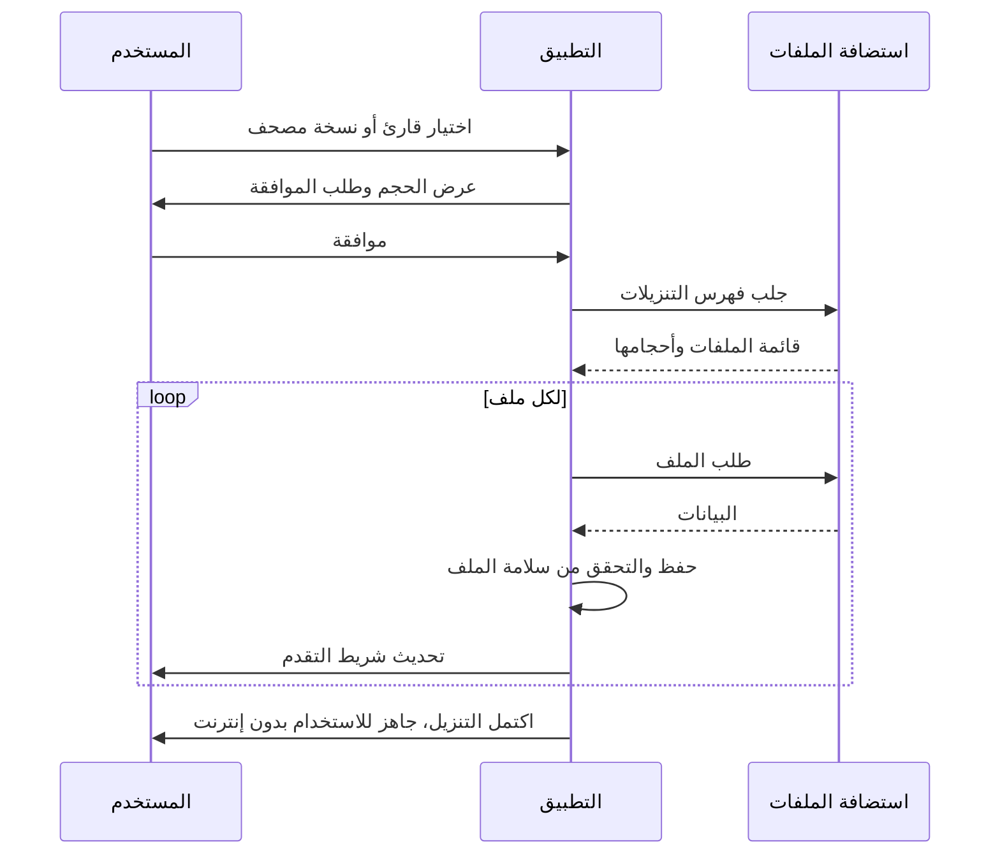

**مميزات إدارة التنزيلات**
- إيقاف مؤقت واستئناف بعد انقطاع الاتصال.
- التحقق من سلامة الملف بعد التنزيل.
- حذف قارئ أو نسخة لتوفير المساحة، مع عرض حجم كل تنزيل.
- تنزيل سورة أو أجزاء بدل القارئ كله (اختياري).
- (اختياري) التنزيل على Wi-Fi فقط.

---

## 9️⃣ النسخة الاحتياطية

لأنه لا توجد حسابات، فالنسخة الاحتياطية اليدوية هي حماية التقدم.

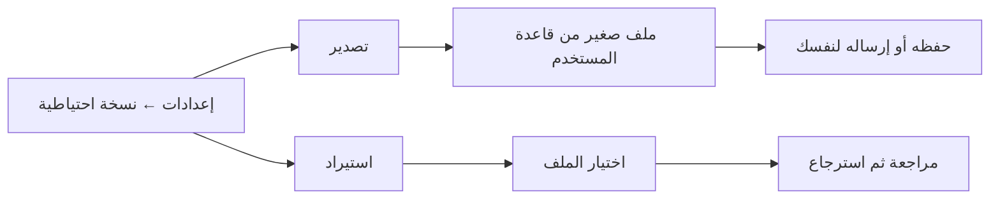

- الملف يشمل: العلامات، الملاحظات، الخطط، حالة المراجعة، الاختبارات، الختمات، الإعدادات.
- (اختياري) تذكير دوري بأخذ نسخة.
- الاستيراد يعرض ملخصًا قبل الاستبدال لتفادي فقدان بيانات حالية.

---

## 🔟 خارطة الطريق والمراحل

| المرحلة | ما يُسلَّم | الحجم التقديري |
|---|---|---|
| **0** | قاعدة بيانات المصحف (سور، آيات، كلمات)، الاتفاق على مصادر النص والصوت، حسم التراخيص | متوسط |
| **1** | المصحف، الاستماع بالتحكم الكامل، الختمة، البحث، علامة الاستمرار والعلامات، التنزيلات، الإعدادات | كبير |
| **2** | الحفظ، المراجعة بالجدولة الذكية، الاختبارات بالمستويات، إخفاء الآيات، النسخة الاحتياطية، الإحصائيات | كبير |
| **3** | فهرس المتشابهات، البحث والمقارنة بتظليل الفروق، التنبيه أثناء القراءة، اختبار المتشابهات | كبير جدًا (بيانات ومراجعة) |
| **4** | التفسير، أسباب النزول، الإعراب الكامل، البيان الإعجازي، معاني الكلمات، التجويد، الفهرس الموضوعي | كبير جدًا (بيانات ومراجعة) |

**معيار اكتمال كل مرحلة (Definition of Done)**
- كل ميزات المرحلة تعمل بدون إنترنت (عدا التنزيل).
- اختبارها على جهازين على الأقل لكل منصة.
- مراجعة المحتوى الجديد شرعيًا ولغويًا قبل الإصدار.
- قياس حجم التطبيق وسرعة البحث.

---

## 1️⃣1️⃣ المحتوى والمصادر والمراجعة الشرعية

> ⚠️ **هذا أهم بند في المشروع.** أي خطأ في نص أو تفسير أو إعراب في تطبيق قرآني حساس. المحتوى لا يُنسخ من مصادر مجهولة، ولا يُصدر قبل مراجعة متخصص.

| المحتوى | نوع المصدر المقترح | ما يجب التحقق منه |
|---|---|---|
| نص المصحف | مصدر معتمد ومحقق (مثل مشروع Tanzil أو نص مجمع الملك فهد) | الترخيص والالتزام بشروط استخدامه، ومطابقة الرسم |
| الصوتيات | تسجيلات قرّاء مرخّصة أو مفتوحة | إذن الاستخدام والتوزيع لكل قارئ |
| التفاسير | تفاسير معروفة (الطبري، ابن كثير، السعدي، الميسر) | نسخة رقمية سليمة ومرخّصة، ومراجعة التنسيق والعزو |
| الإعراب | مراجع في إعراب القرآن | غالبًا **بحقوق نشر**، يلزم إذن أو ترخيص |
| أسباب النزول | مراجع معروفة (كأسباب النزول للواحدي ولباب النقول للسيوطي) | صحة النقل ودرجة الثبوت |
| المتشابهات | مراجع في المتشابه اللفظي + حساب آلي | **مراجعة بشرية كاملة** لكل مجموعة |
| البيان الإعجازي | كتب معتمدة في لطائف التعبير | العزو لصاحب القول |

**مسار المراجعة**

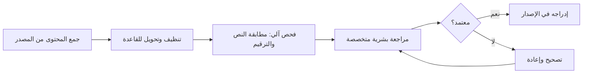

**صفحة "المصادر والمراجعة" داخل التطبيق:** تعرض مصدر كل محتوى، والقائمين على مراجعته، وتراخيصه.

---

## 1️⃣2️⃣ الخصوصية والأداء وإمكانية الوصول

### الخصوصية
- لا حسابات، ولا سيرفر لبيانات المستخدم، ولا تتبع.
- لا صلاحية إنترنت إلا عند التنزيل الاختياري (ويُعلن ذلك للمستخدم).
- كل البيانات على الجهاز، وتُحذف بحذف التطبيق (لذلك النسخة الاحتياطية مهمة).

### الأداء والحجم
- الحجم الأساسي للتطبيق يُراقب بحسب حدود المتاجر (تقريبًا 200 ميجا للتحميل الأساسي).
- ما يزيد (تفاسير كبيرة، صوتيات، مصاحف إضافية) يكون **تنزيلًا اختياريًا**.
- فهارس البحث والمتشابهات **محسوبة مسبقًا** لسرعة الاستجابة.
- تحميل الصفحات بالكسل (Lazy loading) في التفسير والإعراب.

### إمكانية الوصول واللغة
- واجهة عربية بالكامل (RTL) بشكل أساسي.
- دعم أحجام الخط الكبيرة، وقارئات الشاشة، وتباينًا كافيًا للألوان.
- (اختياري لاحقًا) لغات واجهة إضافية.

---

## 1️⃣3️⃣ الجودة والاختبار

| المجال | ما يُختبر |
|---|---|
| **دقة النص** | مطابقة آليّة لكل آية وكلمة مع المصدر، وعدد الآيات لكل سورة |
| **الصوتيات** | مطابقة حدود الآيات مع التتبع أثناء التشغيل |
| **الجدولة** | سلوك المراجعة على فترات طويلة (محاكاة أسابيع وشهور) |
| **الاختبارات** | أن الأسئلة سليمة ومستوى الصعوبة متدرّج فعلًا |
| **المتشابهات** | مراجعة بشرية لكل مجموعة وتظليل الفروق |
| **الأجهزة** | أجهزة قديمة وشاشات صغيرة وأنظمة مختلفة |
| **عدم الاتصال** | تشغيل كل الميزات بوضع الطيران |
| **الاسترجاع** | تصدير واستيراد نسخة احتياطية على جهاز آخر |
| **التنزيل** | انقطاع الشبكة، امتلاء التخزين، ملفات تالفة |

---

## 1️⃣4️⃣ المخاطر والحلول

| الخطر | الأثر | الحل |
|---|---|---|
| تراخيص الإعراب والتفاسير | تعطل ميزة أو مشكلة قانونية | حسم التراخيص في المرحلة 0 قبل بناء أي شيء عليها |
| خطأ في المحتوى | ضرر لسمعة التطبيق والمستخدم | مراجعة شرعية ولغوية، وصفحة مصادر، وآلية لاستقبال التصويبات |
| كِبَر حجم التطبيق | صعوبة التحميل | تنزيلات اختيارية، وضغط قواعد البيانات |
| ضياع تقدم المستخدم | إحباط المستخدم | نسخة احتياطية سهلة وتذكير بها |
| تضخم المشروع | تأخر الإطلاق | العمل على مراحل، وإطلاق أول نسخة مفيدة مبكرًا |
| صعوبة بيانات المتشابهات والإعراب | تأخر المرحلتين 3 و4 | البدء بجمع البيانات مبكرًا بالتوازي مع تطوير الواجهة |
| التسميع الصوتي | تعقيد تقني كبير | تأجيله، والبدء بالاختيار والكتابة وإخفاء الآيات |

---

## 1️⃣5️⃣ القرارات المفتوحة وقائمة المهام

### قرارات تحتاج حسمًا

- [ ] هل ستبرمج بنفسك أم مع مطوّر/فريق؟
- [ ] أي **نص مصحف** ورواية تُعتمد أساسًا (حفص عن عاصم غالبًا)؟
- [ ] أي **القرّاء** يُدعمون في الإصدار الأول؟
- [ ] أي **التفاسير** تدخل داخل التطبيق وأيها تنزيل اختياري؟
- [ ] هل الإجابة في الاختبارات **اختيار/كتابة** أم **تسميع صوتي**؟
- [ ] من الجهة أو الشخص المسؤول عن **المراجعة الشرعية**؟
- [ ] ما **اسم التطبيق** وهويته البصرية؟
- [ ] هل التطبيق مجاني بالكامل أم له نموذج دعم آخر؟

### قائمة البدء العملية

- [ ] كتابة قائمة المصادر المستهدفة لكل محتوى، وحالة ترخيص كل منها
- [ ] بناء قاعدة بيانات المصحف (سور، آيات، كلمات، أجزاء، صفحات)
- [ ] إعداد مشروع Flutter، وتجهيز واجهة القراءة بالخط العثماني
- [ ] بناء مشغّل الصوت مع النطاق والتكرار
- [ ] تصميم قاعدة بيانات المستخدم ونظام النسخة الاحتياطية
- [ ] تجهيز الاستضافة الثابتة لملفات التنزيل
- [ ] إشراك مراجع شرعي منذ البداية
- [ ] بدء جمع بيانات المتشابهات والإعراب بالتوازي مع تطوير المرحلة 1

---

> **خلاصة:** التطبيق يمكن أن يكون مرجعًا فريدًا لو التزمنا بثلاثة أشياء: **دقة المحتوى، والعمل الكامل بدون إنترنت، والبناء على مراحل** يخرج فيها كل إصدار نافعًا بذاته.

